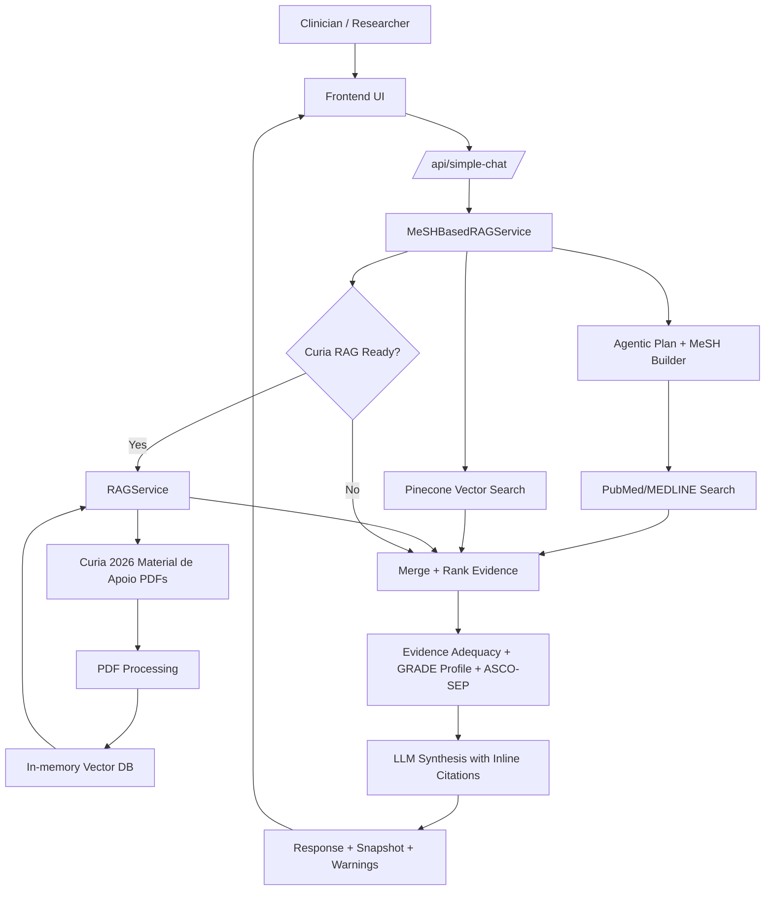

# SilverCancer Architecture

## High-Level Flow

## Curia 2026 Materials
- Only **`Curia 2026/Pré-curso/Material de Apoio`** is used for evidence.
- Slide decks and tests are excluded by default.
- Initialize Curia RAG once per server session via:
  - `POST /api/rag/initialize` with `{"source":"curia_materials"}`.

## Evidence Scoring
- ASCO-SEP hierarchy + recency + quality signals.
- Readiness categories: `Adequate`, `Borderline`, `Limited`, `Insufficient`.
- Limited/insufficient evidence forces “info-only” response format.

## Outputs
- Evidence-linked narrative synthesis with inline citations.
- Clinical snapshot (GRADE, ASCO-SEP, recency, provenance).
- Exportable JSON/PDF for clinical review.
